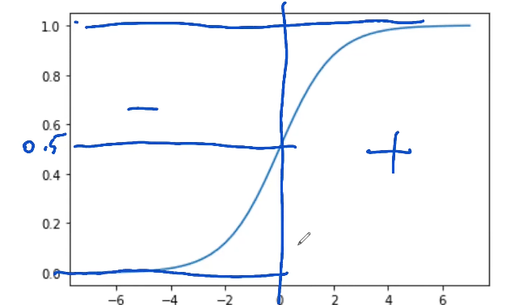

# Module 3. Calssification

## 3.1 Churn prediction projec

Churn predition project introduction. To churn means leave company as a customer to competition. The project role to determine the probablity of a customer to leave for competition or end the contract. So the business could react proactively and retain the customer base, e.g. by sending promotional e-mail.

The approach is **binary classification**:

$g(x_i) \approx y_i$

$x_i$ - $i^{th}$ customer.

$y_i \in \{0, 1\}$, where 0 - negative, 1 - positive.

$g(x_i) \in \{0, 1\}$ - likelihood of churn

## 3.2 Data preparation

Running Linux command in jupyter (use ! before the command, $var - for referencing the variable from the notebook):
```bash
!wget $data
```

Useful methods:
```python
df.heads().T #Transpose the data head when a lot of columns to see them in a list
pd.to_numeric(df.totalcharges, errors='coerce') #Convert column to numeric value
df.churn = (df.churn == 'yes').astype(int) #Replace yes/no text with 0/1. Do not forget to 
```

Usual scenario:
- Make data uniform: replace column names and data to uniform format. Refer to Module 1.
- Fix missing values.
- Check if all columns are read correctly.
- Convert text variables to binary when needed.

## 3.3 Setting up the validation framework

60% / 20% / 20% distribution for Train, Validation, Test

```python
from sklearn.model_selection import train_test_split #Library used to automate distribution process

df_full_train, df_test = train_test_split(df, test_size=0.2, random_state=1) #Split data set into Full train (80%) and test (20$) data sets

df_train, df_val = train_test_split(df_full_train, test_size=0.25, random_state=1) #Note test_size is different due to full_train is already 80%

for df in [df_train, df_val, df_test]:
    df.reset_index(drop=True, inplace=True)

y_train = df_train.churn.values #TODO: Do it for all 3 data sets

del df_train['churn'] #Remove from the original dataset to not accidently use it TODO: do for all 3

```

## 3.4 EDA (Exploritary Data Analysis)

Using full train dataset for EDA

```python
df_full_train.isnull().sum()
df_full_train.churn.value_counts(normalize=True) #Gives churn rate
global_churn_rate = df_full_train.churn.mean() #Gives the same values as value_counts because the values of curn is {0, 1}, because zeroes are ignored and 1 are counted
df_full_train.dtypes() #Check data types and apply fixes
numerical = ['tenure', 'monthlycharges', 'totalcharges']
categorical = ['.....']# take all columns from df_full_train.columns and remove numerical columns from the list
df_full_train[categorical].nunique()
```

## 3.5 Feature importance: Churn rate and risk ratio

Feature importance analysis is part of EDA.

```python
# Look at churn rates of different groups
df_full_train[df_full_train.gender == 'female'].churn.mean()
df_full_train[df_full_train.gender == 'male'].churn.mean()
global_churn = df_full_train.churn.mean()

df_full_train.partner.value_counts()
churn_partner = df_full_train[df_full_train.partner == 'yes'].churn.mean()
churn_no_partner = df_full_train[df_full_train.partner == 'no'].churn.mean()
```
Churn for gender is not significant, so gender does not affect churn rate
However, churn rate for partner parameter is significat. Intuitions tells us that this difference can be used for churn prediction.

### Difference

$Global - Group$

$<0$ - more likely to churn, $>0$ - less likely to churn

### Risk ration
$Risk = \displaystyle \frac{Global}{Group}$

$Risk >1$ - more likely to churn, $Risk < 1$ - less likely to churn

```SQL
SELECT
    gender,
    AVG(churn),
    AVG(churn) - global_churn AS diff.
    AVG(churn) / global_churn AS risk
FROM
    data
GROUP BY
    gender;
```
```python
from IPyhton.display import display

for c in categorical:
    df_group = df_full_train.groupby(c).churn.agg(['mean', 'count'])
    df_group['diff'] = df_group['mean'] - global_churn
    df_group['risk'] = df_group['mean'] / global_churn
    display(df_group)
    print(df_group)
    print()

```
Use difference and risk to intuitevely find out important and not important categories.

## 3.6 Feature importance: Mutual information

Mutual information - a way to measure importance of categorical variables. [Wiki](https://en.wikipedia.org/wiki/Mutual_information)

```python
from sklearn.metrics import mutual_info_score

mutual_info_score(df_full_train.churn, df_full_train.contract)
mutual_info_score(df_full_train.churn, df_full_train.gender)
mutual_info_score(df_full_train.churn, df_full_train.contract) #etc

#Apply this metric to all categorical variables
def mutual_info_churn_score(series):
    return mutual_info_score(series, df_full_train.churn)

mi = df_full_train[categorical].apply(mutual_info_churn_score)
mi.sort_values(ascending=False)
```

## 3.7 Feature importance: Correlation

Pearson's colleration or correlation coefficient. [Wiki](https://en.wikipedia.org/wiki/Pearson_correlation_coefficient)

$-1 \leqslant 0 \leqslant 1$

When $x$ grows and $y$ drops - correlation is negative, and if both grow or drop then corellation is positive.

- Low correlation $\in (0.0, 0.1)$ or $(-0.1, 0.0)$ *(rarely)*
- Mederate correlation $\in (0.0, 0.2)$ or $(-0.2, 0.0)$ *(sometimes)*
- Strong correlation $\in (0.0, 0.6)$ or $(-0.6, 0.0)$ *(often)*

$y \in {0,1}, x \in R$

- Positive correlation means, when more tenure -> higher the churn rate
- Nagative correlation means, when more tenure -> less churn
- Zero -> No correlation

```python
df_full_train[numerical].corrwith(df_full_train.churn) #calculate correlation

df_full_train[df_full_train.tenure <= 2].churn.mean()
df_full_train[(df_full_train.tenure > 2) & (df_full_train.tenure <= 12)].churn.mean()
df_full_train[df_full_train.tenure > 12].churn.mean()
#Use the same for other columns to check correlation

```

## 3.8 One-hot encoding
Use of Scikit-Learn to encode categorical features.

$G \in \{F, M\}, C \in \{M, Y_1, Y_2\}$

```python
from sklearn.feature_extraction import DictVectorizer

dicts = df_train[['gender','contract']].iloc[:100].to_dict(orient='records') #Turns columns to a list of dictionaries by rows
dv = DictVectorizer(sparce=False) #Not to use Sparce Matrices
dv.fit(dicts) #Train dv on out data, so the values can be infered later
dv.transform(dicts) #Produces sparce row format by default, modified by sparce parameter in constructor (google Sparce Matrix), otherwise produces array or vectors
# DictVectorizer will leave numerical values intacts, and categorical variables are converted to vector with {0,1} values.
# In the end it should be trained on [categorical + numerecal]
X_train = dv.fit_transform(train_dicts)
val_dicts = df_val[categorical + numerical].to_dict(orient='records')
X_val = dv.transform(val_dicts)
```

## 3.9 Logistics regression

$g(x_i) = y_i$, model = target

$y_i$ can be regression or classification (*binary* or multicalss).

Logistics regression is binary classification.

$y_i \in \{0, 1\} or \{negative, positive\}$

$g(x_i) \rightarrow [0,1]$ - probability of $x_i$ belonging to the positive class.

$g(x_i) = w_0 + w^T x_i \in (-\infty, +\infty)$

$g(x_i) = SIGMOID(w_0 + w^T x_i) \in (0, 1)$

$SIGMOID = \displaystyle \frac{1}{1 + exp(-z)}$

```python
def sigmoid(z):
    return 1 / (1 + np.exp(-z))

#Testing function
z = np.linspace(-5, 5, 51)
plt.plot(z, sigmoid(z))
```


Sigmoid is used to convert score to probability.

```python
def linear_regression(xi):
    result = w0

    for j in range(len(w)):
        result = result + xi[j] * w[j]

    return result

def logistics_regression(xi):
    score = w0

    for j in range(len(w)):
        score = score + xi[j] * w[j]

    return sigmoid(score)
```

Both functions are using dot product that why they are regressions.

## 3.10 Training logistics regression Scikit-Learn

```python
from sklearn.linear_model import LogisticsRegression

model = LogisticsRegression()
model.fit(X_train, y_train) #Training a model

model.coef_ #Weights, coef_[0] gives w
model.intercept_[0] #Bias (w0) called incercept

#Using model
model.predict(X_train) #HARD PREDICTIONS
model.predict_proba(X_train) #Soft predictions, return two dementional matrix
#Two columns: probability of 0, probablity of 1
y_pred = model.predict_proba(X_val)[:, 1]
y_pred >= 0.5 #Convert soft prediction to hard prediction

churn_decision = (y_pred >= 0.5)
(y_val == churn_decision).mean()

#Checking the correctness
df_pred = pd.DataFrame()
df_pred['probablity'] = y_pred
df_pred['prediction'] = churn_decision.astype(int)
df_pred['actual'] = y_val

df_pred['correct'] = df_pred.prediction == df_pred.actual
df_pred.correct.mean()
#===> Which is what happens for:
(y_val == churn_decision).mean()

```

## 3.11 Model interpretation

```python
#Connect features with coefficient values
dict(zip(dv.get_feature_names(), model.coef_[0].round(3)))

#Training a smaller model
small = ['onctract', 'tenure', 'monthlycharges']
df_train[small].iloc[:10].to_dict(orient='records')

dicts_train_small = df_train[small].to_dict(orient='records')
dicts_val_small = df_val[small].to_dict(orient='records')

dv_small = DictVectorizer(sparce=False)
dv_small.fit(dicts_train_small)
dv_small.get_feature_names()
X_train_small = dv_small.trainsform(dicts_train_small)
model_small = LogisticsRegression()
model_small.fit(X_train_small, y_train)
w0 = model_small.intercept_[0]
w = model_small.coef_[0]

dict(zip(dv_small.get_feature_names(), w.round(3)))
```
$w_0 +$ contract (montly, 1 year, 2 years) $+$ montly carges $+$ tenure

$-2.47 + 1 \cdot 0.97 + 0 \cdot (-0.025) + 0 \cdot (-0.949) + 50 \cdot 0.027 + 5 \cdot (-0.036) = -0.33$

```python
sigmoid(_) # _ is magic variable here which means the previous output in jupyter
```

## 3.12 Using the model

```python
dicts_full_train = df_full_train[categorical + numerical].to_dict(orient='records')
dv = DictVectorizer(sparse=False)
X_full_train = dv.fit_transform(dicts_full_train)
y_full_train = df_full_train_churn.values
model = LogisticsRegression().fit(X_full_train, y_full_train)

dicts_test = df_test[categorica + numerical].to_dict(orient='records')
X_test = dv.transform(dicts_test)
y_pred = model.predict_proba(X_test)[:, 1]

churn_decision = (y_pred >= 0.5)

(churn_decision == y_test).mean() #Model prediction probability

#Using the model
customer = dicts_test[10]
X_small = dv.transform([customer]) #1 customer, 45 features
model.predict_proba(X_small)[0, 1] #Get probability of churning
y_test[10] #Check the original dataset value
```

## 3.13 Summary

- Data preparation
- Setting the validation framework
- EDA (Exploritory Data Analysis)
- Feature importance: churn rate and risk ratio, mutual information
- One-hot encoding: the way of encoding categorical features
- Logistics regression: model for binary classification problems, which is similar to linear regression, but uses sigmoid function.
- Training model with Scikit-Learn
- Using the model