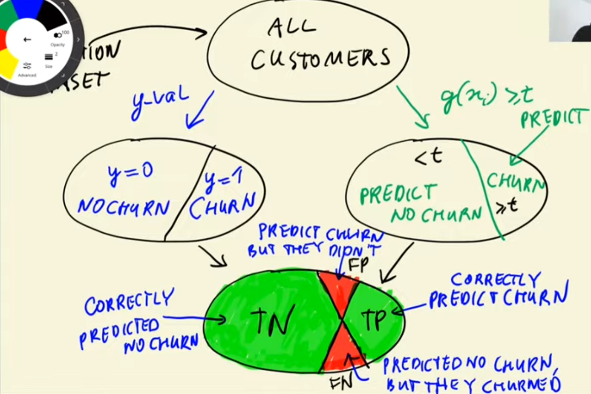
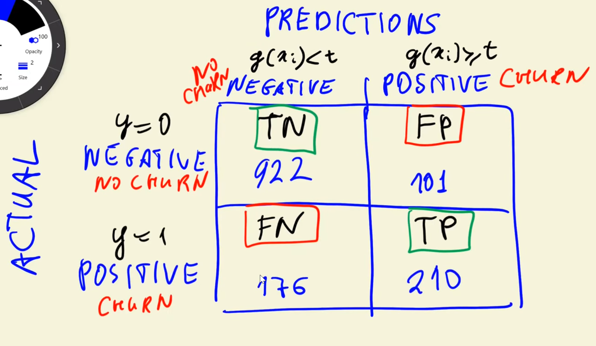
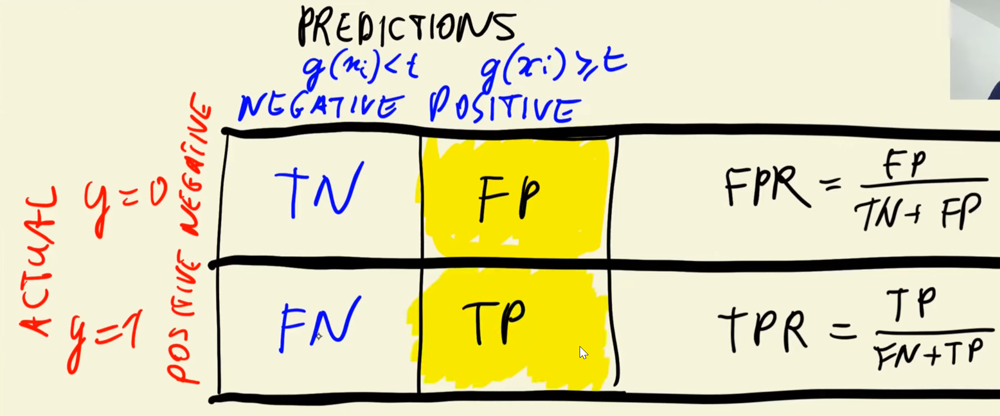
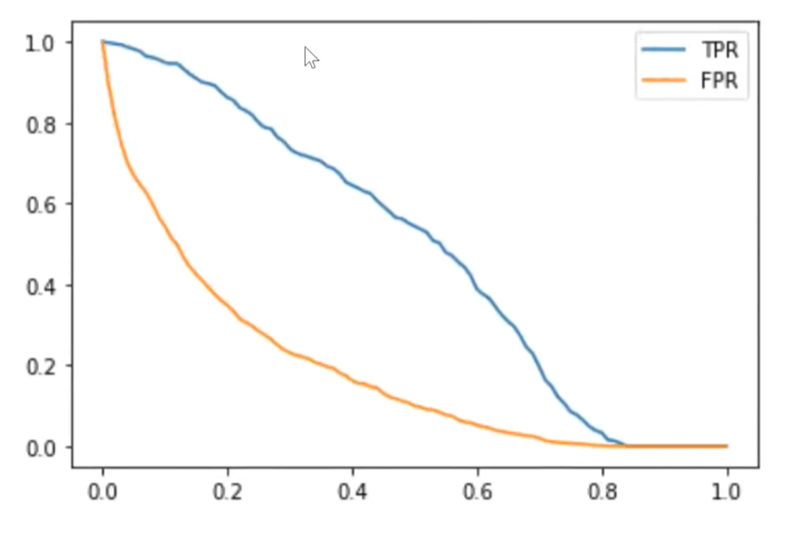
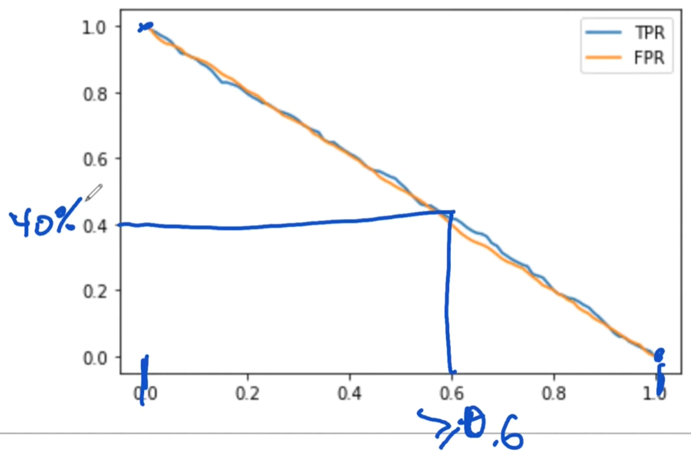
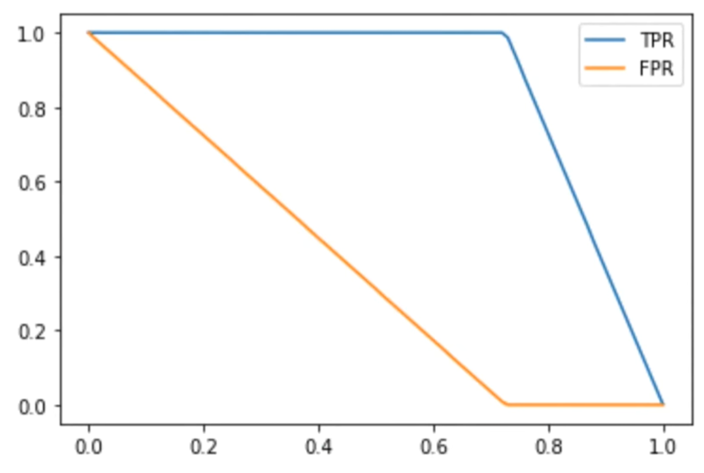
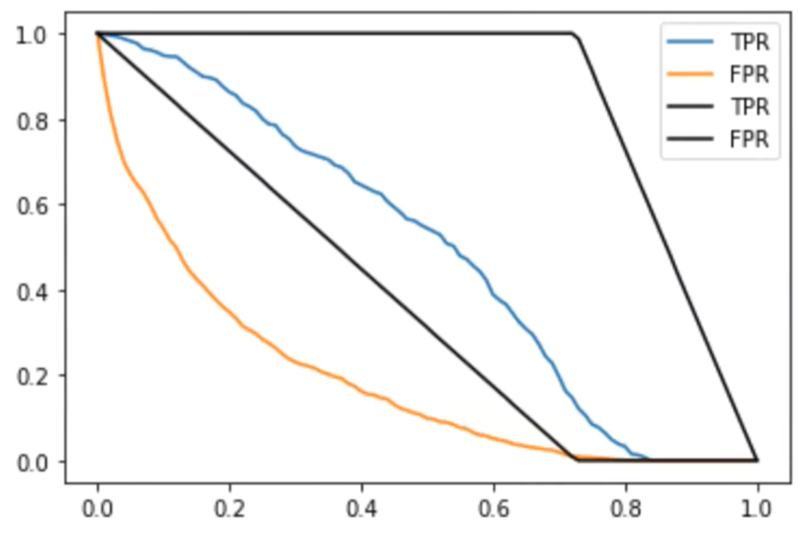
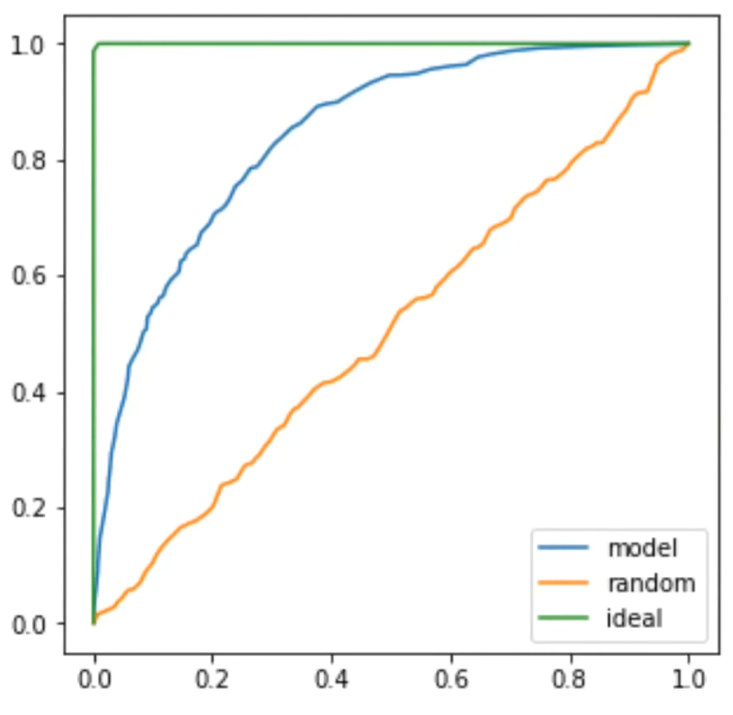
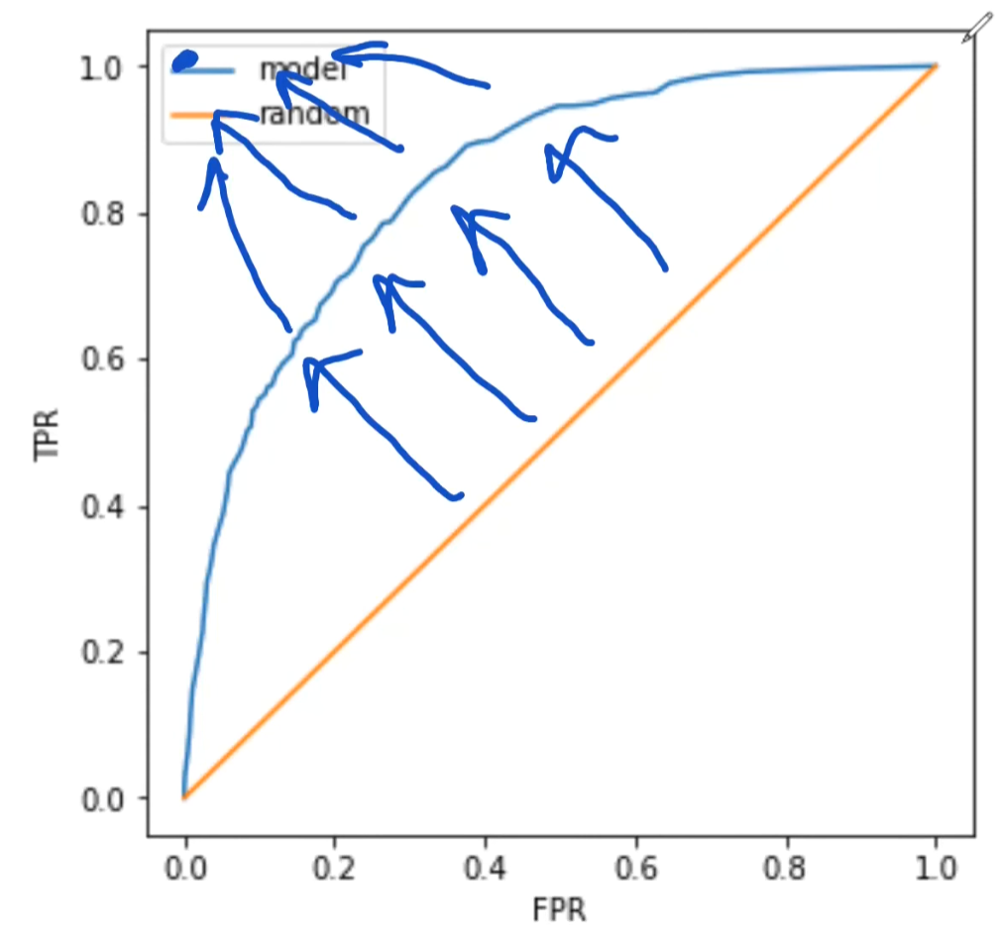
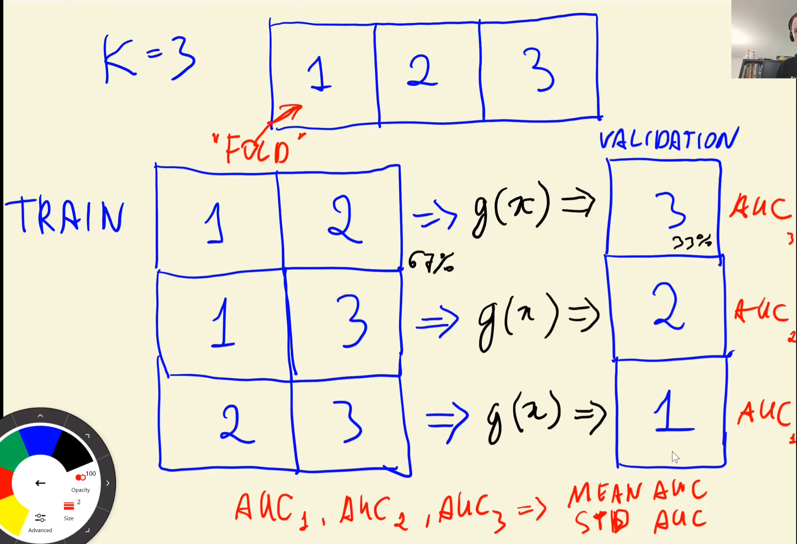

# Module 4. Evaluation Metrics for Classification

## 4.1 Recap and briefing

- Churn prediction, model accuracy 80%
- Is it a good score? How to evaluate it?

## 4.2 Accuracy and dummy model

Accuracy tells us the fraction of correct prediction.

Is decision threshold 0.5 good or should it be altered?

```python
thresholds = np.linspace(0, 1, 21) #Create array of thresholds

scores = []
for t in thresholds:
    churn_decision = (y_pred == t)
    score = (y_val == churn_decision).mean()
    scores.apprend(score)

plt.plot(thresholds, scores) #plot the results
```

As result on the graph it is shown that 0.5 is the optimal threshold.

```python
from sklearn.metrics import accuracy_score
accuracy_score(y_val, y_pred >= 0.5) #Calulcated accurace score, usage below

thresholds = np.linspace(0, 1, 21)
scores = []
for t in thresholds:
    score = accuracy_score(y_val, y_pred >= t)
    scores.apprend(score)
```

```python
from collections import Counter
Counter(y_prod >= 1.0) #Userful for counting things
```

Class imbalance - there are way more non-churning customers than the one who is churning.

## 4.3 Confusion table

A way of looking at correct decision for binary classification problems.

$g(x_i) \geqslant t$ - churn (positive class)

Possible scenarious:
- Customer didn't churn **(incorrect)** *False positive*
- Customer did churn **(correct)** *True positive*

$g(x_i) \lt t$ - no churn (negative class)

Possible scenarious:
- Customer didn't churn **(correct)** *True negative*
- Customer did churn **(incorrect)** *False negative*

Validation dataset can be split into two:
- Validation dataset
    - All customers
        - `y_val` : $y=0$ no churn / $y=1$ churn
        - $g(x_i) \geqslant t$ : predict nochurn ($<t$) / pedict churn ($\geqslant t$)



- True positive (TP): $g(x_i) \geqslant t$ & $y=1$
- True negative (TN): $g(x_i) < t$ & $y=0$
- False negative (FN): $g(x_i) < t$ & $y=1$
- False positive (FP): $g(x_i) \geqslant t$ & $y=0$

```python
actual_positive = (y_val == 1)
actual_negative = (y_val == 0)
t = 0.5 #threshold
predict_positive = (y_pred >= t)
predict_negative = (y_pred < t) 

tp = (predict_positive & actual_positive).sum() #True positives
tn = (predict_negative & actual_negative).sum() #True negatives
fp = (predict_positive & actual_negative).sum() #False positives
fn = (predict_negative & actual_positive).sum() #False negatives
```

Confusion table is a way to put all the values and erros in a single table.



```python
confusion_matrix = np.array([
    [tn, fp],
    [fn, tp]
 ])
confusion_matrix / confusion_matrix.sum() #Normalized confusion matrix
```
$Accuracy = TN + TP$

## 4.4 Precision and Recall

```python
(tp + tn) / (tp + tn + fp + fn) #Accuracy
```

Precision is a fraction of positive predictions that are correct.

$Precision = \displaystyle \frac{TP}{\#PositivePred} = \frac{TP}{TP+FP}$

Recall is a fraction of correctly identified positive examples.

$Recall = \displaystyle \frac{TP}{\#PositiveObservations} = \frac{TP}{TP + FN}$

For example,
- Precision = 67% (33% identified incorrectly)
- Recall = 54% (46% failed to identify)
- Accuracy = 80%

## 4.5 ROC Curves

Reciever Operating Characteristics - a way to describe the performance of a binary classification model.

- FPR - false positive rate
- TPR - true positive rate

$FPR = \displaystyle \frac{FP}{TN + FP}$

$TPR = \displaystyle \frac{TP}{FN + TP}$



FPR should be as low as possible. TPR should be as high as possible.

```python
tpr = tp / (tp + fn) #the same value as recall
fpr = fp / (fp + tn)

#Look and evaluate values for possible thresholds
scores = []

thresholds = np.linspace(0, 1, 101)
for t in thresholds:
    actual_positive = (y_val == 1)
    actual_negative = (y_val == 0)

    predict_positive = (y_pred >= t)
    predict_negative = (y_pred < t)

    tp = (predict_positive & actual_positive).sum() #True positives
    tn = (predict_negative & actual_negative).sum() #True negatives
    fp = (predict_positive & actual_negative).sum() #False positives
    fn = (predict_negative & actual_positive).sum() #False negatives

    scores.append((t, tp, fp, fn, tn))

columns = ['threshold', 'tp', 'fp', 'fn', 'tn']
df_scores = pd.DataFrame(scores)
df_scores['tpr'] = df_scores.tp / (df_scores.tp + df_scores.fn)
df_scores['fpr'] = df_scores.fp / (df_scores.fp + df_scores.tn)

plt.plot(df_scores.threshold, df_scores['tpr'], label='TPR')
plt.plot(df_scores.threshold, df_scores['fpr'], label='FPR')
plt.legend()
```


### Random uniform model


### Ideal model
```python
np.repeat([0,1], [num_neg, num_pos]) #Creates an array which repeats 0 num_neg times and 1 num_pos times.
```


### Putting all models together



X axis - FPR, Y axis - TPR:


Achieving ideal model:


```python
plt.figure(figsize=(5,5)) #Change size of plot area to 5x5
plt.xlabel('X label')
plt.ylabel('Y label')
```
Using SKLearn library to calculate ROC:
```python
from sklearn.metrics import roc_curve
fpr, tpr, thresholds = roc_curve(y_val, y_pred)

plt.figure(figsize=(5,5))

plt.plot(fpr, tpr, label='Model')
plt.plot([0,1],[0,1], label='Random', linestyle='--')

plt.xlabel('FPR')
plt.ylabel('TPR')

plt.legend()
```

## 4.6 ROC AUC
AUC - Area Under the Curve (Reciever Operating Characteristics) for binary classification models.

Ideal model ROC AUC is 1.0.     
```python
from sklearn.metrics import auc

auc(fpr, tpr)
```
```python
from sklearn.metrics import roc_auc_score

roc_auc_score(y_val, y_pred) #combines ROC and AUC calculation in one function
```

AUC is probability that the score of randomly selected positive example is higher than randomly selected negative example.

$P(RSPE > RSNE) = AUC$

```python
#Calculating probablity in vectorized form
n = 10000
pos_ind = np.random.randint(0, len(pos), size=n)
neg_ind = np.random.randint(0, len(neg), size=n)
(pos[pod_ind] > neg[neg_ind]).mean()
```

## 4.7 K-Fold Cross-Validation

Train / Validation / Test

Full train (Train + Validation) / Test

But what if:


```python
def train(df, y, C=1.0):
    dicts = df[categorical + numerical].to_dict(orient='records')

    dv = DictVectorizer(sparce=False)
    X_train = dv.fit_transform(dicts)

    model = LogisticsRegression(C=C, max_iter=1000)
    model.fit(X_train, y_train)

    return dv, model

dv, model = train(df_train, y_train)

def predict(df, dv, model):
    dicts = df[categorical + numerical].to_dict(orient='records')

    X = dv.transform(dicts)
    y_pred = model.predict_proba(X)[:, 1]

    return y_pred

y_pred = predict(df_val, dv, model)

```
```python
from sklearn.model_selection import KFold
from tqdm.auto import tqdm #Library used to show the progress

n_splits = 5
kfold = KFold(n_splits=n_splits, shuffle=True, random_state=1)

for C in tqdm([0.001, 0.01, 0.1, 0.5, 1, 5, 10]):

    scores = []

    for train_idx, val_idx in kfold.split(df_full_train):
        df_train = df_full_train.iloc[train_idx]
        df_val = df_full_train.iloc[val_idx]

        y_train = df_train.churn.values
        y_val = df_val.churn.values

        dv, model = train(df_train)
        y_pred = predict(df_val, dv, model)

        auc = roc_auc_score(y_val, y_pred)
        scores.append(auc)

    print('C=%s %.3f +- %.3f' % (C, np.mean(scores), np.std(scores)))
```
```python
!pip install tqdm
```
```python
#Training final model
dv, model = train(df_full_train, df_full_train.churn.values, C=1.0)
y_pred = predict(df_test, dv, model)

auc = roc_auc_score(y_val, y_pred)
auc
```

## 4.8 Summary

- Metric - a single number that describes performance of the model
    - Acciracy - amount of correct answers (not always good, other metrics are better when there is class imbalance)
    - Precision
    - Recall
- Confusion table
- ROC curve and ROC AUC
- Parameter tuning with KFold