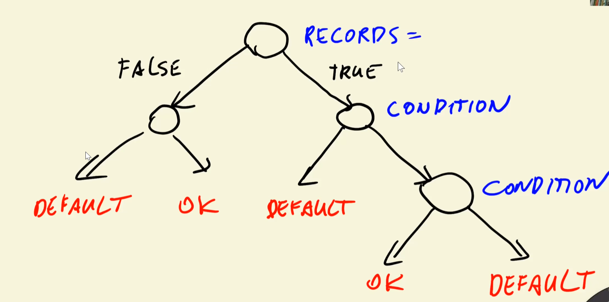
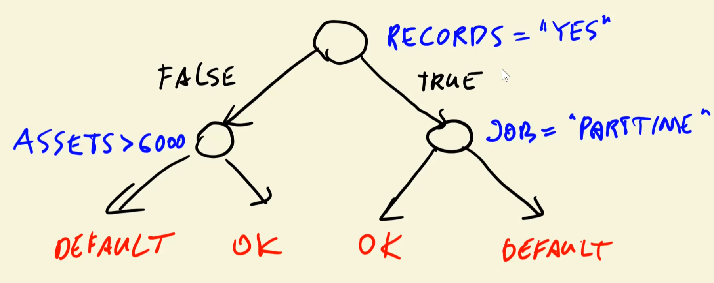
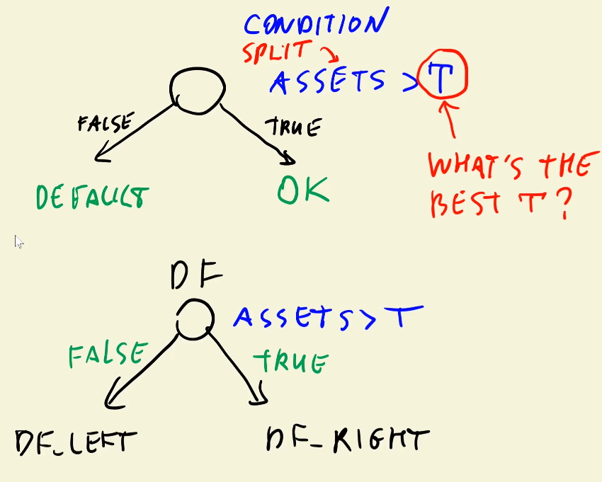
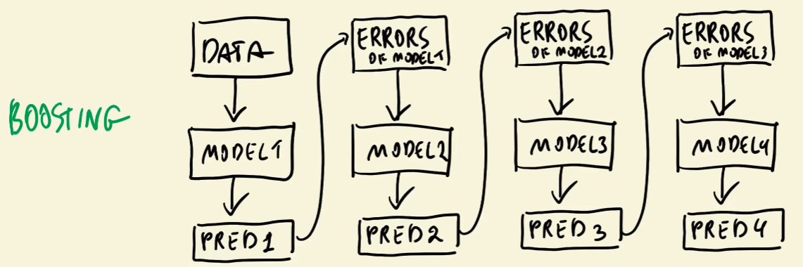

# Module 6. Decision Trees and Ensemble Learning

## 6.1 Credit Risk Scoring

Analysing an creadit or loan application to make decision about creditworthiness and risks of defaults. The model return the probablity of default.

Binary classification problem:
$y_i \in \{0,1\}$

$g(x_i)$ - probability of default

## 6.2 Data cleaning and preparation

```python
df.columns = df.columns.str.lower()

# Fixing categorical data
status_values = {
    1: 'ok',
    2: 'default',
    0: 'unknown'
}
df.status = df.status.map(status_values)
# TODO: The same needs to be done with other categorical columns

# Fixing missing values
df.describe() 
for c in ['income', 'assets', 'debt']:
    df[c] = df[c].replace(to_replace=9999999999, value=np.nan).max()

df.status.value_counts()
df[df.status != 'unknown'].reset_index(drop=True)

from sklearn.model_selection import train_test_split

df_full_train, df_test = train_test_split(df, test_size=0.2, randrom_state=11)
df_train, df_val = train_test_split(df, test_size=0.25, randrom_state=11)
df_train = df_train.reset_index(drop=True) # TODO: Do it for all 3 data sets

y_train = (df_train == 'default').astype('int').values # TODO: Do the same for all data sets
```

## 6.3 Decision trees

Binary tree which have conditiona at its nodes, and branches are True/False decision:



```python
# Manual coding example:
def assets_risk(client):
    if client['records'] == 'yes':
        if client['Job'] == 'partime':
            return 'default'
        else:
            return 'ok'
    else:
        if client['assets'] > 6000:
            return 'ok'
        else
            return 'default'

# Training the model
from sklearn.tree import DecisionTreeClassifier
from sklearn.feature_extraction import DictVectorizer
from skleaen.metrics import roc_auc_score

train_dicts = df_train.fillna(0).to_dict(orient='records')
dv = DictVectorizer(sparce=False)
X_train = dv.fit_transform(train_dicts) # Feature matrix
dv.get_feature_names()

dt = DecisionTreeClassifier()
dt.fit(X_train, y_train)

val_dicts = df_val.fillna(0).to_dict(orient='records')
X_val = dv.transform(val_dicts)
y_pred = dt.predict_proba(X_val)[:, 1]

roc_auc_score(y_val, y_pred) # = 0.6548

y_pred = dt.predict_proba(X_train)[:, 1]
roc_auc_score(y_train, y_pred) # = 1.0 - overfitting
```

Overfitting - memorizes the data but fails to generalize to new data. Usually it happens because conditions in the decision tree are very specific.

If the tree depth is limited, the model will be less likely to overfit:

```python
dt = DecisionTreeClassifier(max_depth=3)
dt.fit(X_train, y_train)
```

Decision stump - a decision tree with max_depth=1

```python
# Tree visualization
from sklearn.tree import export_text
print(export_text(dt, feature_names=dv.get_feature_names()))
```

## 6.4 Decision tree learning algorithm

Finding the best $T$ (threshold) for each feature to split the data into two parts.



Classification rate show how many samples are classified correctly. Misclassification rate is 1 - classification rate.

```python
df_left.status.value_counts(normalize=True) # Proportion of each class in the left split
```

Misclassification rate is impurity measure. There are other ways to measure impurity as well.

Final impurity is average of impurities of two splits.

```python
from IPython.display import display

thresholds = {
    'assets': [0, 1000, 2000, 3000, 4000, 5000],
    'debt': [500, 1000, 2000],
}

for feature, Ts in thresholds.items():
    print('--------------')
    print(f'Feature: {feature}')
    for T in Ts:
        print(f'Threshold: {T}')
        df_left = df_example[df_example[feature] <= T]
        df_right = df_example[df_example[feature] > T]
        
        display(df_left)
        print(df_left.status.value_counts(normalize=True))
        display(df_right)
        print(df_right.status.value_counts(normalize=True))
```

Finding the best feature and threshold to split the data:

```
for F in features:
    find all possible thresholds T for feature F
        for T in thresholds:
            split the data into df_left and df_right using "F>T" condition
            compute impurity of the split

select F and T with the lowest impurity
```

How do we know when to stop splitting?
- Group is already pure (all samples belong to the same class)
- Tree reached max depth limit
- Group is too small (less than min_samples_split)

### Decision tree learning algorithm
- Find the best split (feature and threshold) using impurity measure
- Stop if max_depth is reached
- If left is sufficiently large and not pure, recursively build left subtree
- If right is sufficiently large and not pure, recursively build right subtree

## 6.5 Decision tree parameter tuning

```python
for d in [2,3,4,5,6,10,15,20, None]: # None means no limit on depth
    dt = DecisionTreeClassifier(max_depth=d)
    dt.fit(X_train, y_train)

    y_pred = dt.predict_proba(X_val)[:, 1]
    auc = roc_auc_score(y_val, y_pred)

    print('%4s %0.3f' % (d, auc))
```

```python
scores = []

for d in [4, 5, 6, 7, 8, 10, 15, 20, None]:
    for s in [1, 2, 5, 10, 20, 100, 200, 500]:
        dt = DecisionTreeClassifier(max_depth=d, min_samples_split=s)
        dt.fit(X_train, y_train)

        y_pred = dt.predict_proba(X_val)[:, 1]
        auc = roc_auc_score(y_val, y_pred)

        scores.append((d, s, auc))

df_scores = pd.DataFrame(scores, columns=['max_depth', 'min_samples_split', 'auc'])
df_scores.sort_values(by='auc', ascending=False).head()
```
Visualizing the results using heatmap:
```python
import seaborn as sns

df_scores_pivot = df_scores.pivot(index='min_samples_split', columns='max_depth', values='auc') # puts min_samples_split on rows and max_depth on columns and each crosscell contains auc value
sns.heatmap(df_scores_pivot, annot=True, fmt='.3f')
```
Final decision tree training with best parameters:
```python
dt = DecisionTreeClassifier(max_depth=6, min_samples_split=15)
dt.fit(X_train, y_train)
```

## 6.6 Ensemble learning and random forests

There are several models $g_1(x), g_2(x), ..., g_n(x)$. The result probabilities of those models are averaged to get the final prediction:
$$g(x) = \frac{1}{n} \sum_{m=1}^{n} g_m(x)$$

Random forest - an ensemble of decision trees where each tree is trained on a random subset of the features.
So, each model gets a random subset of features to train on.

```python
from sklearn.ensemble import RandomForestClassifier

rf = RandomForestClassifier(n_estimators=10, random_state=1)
rf.fit(X_train, y_train)
y_pred = rf.predict_proba(X_val)[:, 1]

roc_auc_score(y_val, y_pred)
```
Getting the optimal number of trees:
```python
scores = []

for n in range(10, 201, 10):
    rf = RandomForestClassifier(n_estimators=n, random_state=1)
    rf.fit(X_train, y_train)

    y_pred = rf.predict_proba(X_val)[:, 1]
    auc = roc_auc_score(y_val, y_pred)

    scores.append((n, auc))

df_scores = pd.DataFrame(scores, columns=['n_estimators', 'auc'])
plt.plot(df_scores.n_estimators, df_scores.auc)
plt.xlabel('Number of trees')
plt.ylabel('AUC')
plt.title('Random Forest: Number of Trees vs AUC')
plt.show()
```
Tuning other parameters of random forest:
```python
scores = []

for d in [5, 10, 15]:
    for n in range(10, 201, 10):
        rf = RandomForestClassifier(n_estimators=n, max_depth=d, random_state=1)
        rf.fit(X_train, y_train)

        y_pred = rf.predict_proba(X_val)[:, 1]
        auc = roc_auc_score(y_val, y_pred)

        scores.append((d, n, auc))

df_scores = pd.DataFrame(scores, columns=['max_depth', 'n_estimators', 'auc'])

for d in [5, 10, 15]:
    df_subset = df_scores[df_scores.max_depth == d]
    plt.plot(df_subset.n_estimators, df_subset.auc, label=f'max_depth={d}')

plt.legend()
plt.xlabel('Number of trees')
plt.ylabel('AUC')
plt.title('Random Forest: Number of Trees vs AUC')
plt.show()
```
The same process can be done for tuning min_samples_leaf parameter as well.
```python
for s in [1. 3. 5, 10, 50]:
    df_subset = df_scores[df_scores.min_samples_leaf == s]
    plt.plot(df_subset.n_estimators, df_subset.auc, label=f'min_samples_leaf={s}')

plt.legend()
```
At the end, train the final model with the best parameters.
Another useful parameter to use:
- max_features - the number of features to consider when looking for the best split. By default, it's set to "auto" which means sqrt(total number of features).
- bootstrap=True - means that each tree is trained on a random subset of samples with replacement.


Useful parameter for speeding up training:
n_jobs=-1 - uses all available CPU cores for training.

## 6.7 Gradient boosting and XGBoost

Gradient boosting - an ensemble learning technique that builds models sequentially, with each new model trying to correct the errors of the previous ones.



```python
!pip install xgboost
```

```python
import xgboost as xgb

features = dv.get_feature_names()
dtrain = xgb.DMatrix(X_train, label=y_train, feature_names=features)
dval = xgb.DMatrix(X_val, label=y_val, feature_names=features)

xgb_params = {
    'eta': 0.1, # learning rate
    'max_depth': 6, # max tree depth
    'min_child_weight': 1, # min sum of instance weight needed in a child
    
    'objective': 'binary:logistic', # binary classification
    'eval_metric': 'auc', # evaluation metric used to evaluate the model

    'nthread': 8, # number of parallel threads
    'seed': 1, # random seed
    'verbosity': 1 # verbosity level
}
model = xgb.train(xgb_params, dtrain, num_boost_round=200)

y_pred = model.predict(dval)

roc_auc_score(y_val, y_pred)

# watching training process
%%capture output # capture output to use later

watchlist = [(dtrain, 'train'), (dval, 'val')]
model = xgb.train(xgb_params, dtrain, num_boost_round=200, evals=watchlist, verbose_eval=5)

def parse_xgb_output(output):
    results = []

    for line in output.stdout.strip().split('\n'):
        it_line, train_line, val_line = line.split('\t')

        it = int(it_line.strip('[]'))
        train = float(train_line.split(':')[1])
        val = float(val_line.split(':')[1])

        results.append((it, train, val))
    
    df_results = pd.DataFrame(results, columns=['num_iterations', 'auc_train', 'auc_val'])
    return df_results

df_score = parse_xgb_output(output)
plt.plot(df_score.num_iterations, df_score.auc_train, label='Train AUC')
plt.plot(df_score.num_iterations, df_score.auc_val, label='Validation AUC')
plt.legend()
```

## 6.8 XGBoost parameter tuning

```python
# Tuning learning rate (eta)
scores = {}
key = 'eta=%s' % (xgb_params['eta'])
scores[key] = parse_xgb_output(output)

for key, df_score in scores.items():
    plt.plot(df_score.num_iterations, df_score.auc_val, label=key)
plt.legend()
```

Usual parameters to tune:
- eta (learning rate)
- max_depth
- min_child_weight

```python
# Useful zooming in on the plot
plt.ylim(0.7, 0.75)
```

Other useful parameters:
- subsample - fraction of training samples to use for each tree. Typical values: 0.5-1.0
- colsample_bytree - fraction of features to use for each tree. Typical values:
- lambda - L2 regularization term on weights. Typical values: 1-10
- alpha - L1 regularization term on weights. Typical values: 0-10

## 6.9 Selecting the final model

The best model is selected based on the performance on the validation set.

```python
# For each model, make predictions on the validation set and get AUC score
models = {
    'decision_tree': dt,
    'random_forest': rf,
    'xgboost': model
}

y_preds = {}
for name, model in models.items():
    if name == 'xgboost':
        y_pred = model.predict(dval)
    else:
        y_pred = model.predict_proba(X_val)[:, 1]
    
    auc = roc_auc_score(y_val, y_pred)
    y_preds[name] = y_pred
    print(f'{name}: AUC={auc:.4f}')
```

After selecting the best model, retrain it on the full training data (train + validation) before evaluating on the test set. See previous lectures for code examples on how to do this.

## 6.10 Summary

- Limited depth decision trees improves validation performance.
- Algorithm for decsion tree and random forests.
- Tuning decision tree and random forest parameters.